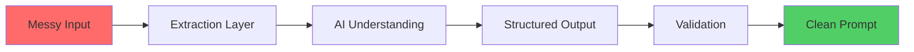

<div align="center">

# 🧠 Multi-Modal Prompt Refinement System

### Transform messy inputs into clean, AI-ready prompts

[](https://www.python.org/downloads/)
[](https://fastapi.tiangolo.com/)
[](https://streamlit.io/)
[](LICENSE)

[Features](#-features) •
[Demo](#-demo) •
[Installation](#-installation) •
[Usage](#-usage) •
[Architecture](#-architecture) •
[Contributing](#-contributing)

</div>

---

## 📌 Overview

A production-grade system that converts **unstructured, multi-modal user inputs** into standardized, AI-ready prompts. Built to solve the fundamental challenge of handling real-world user data in AI applications.

### The Problem

Users rarely provide clean inputs. They give:
- 💬 Informal text descriptions
- 🖼️ Screenshots and images
- 📄 PDF documents
- 📝 Incomplete specifications

Sending this directly to AI results in:
- ❌ Hallucinations
- ❌ Inconsistent outputs
- ❌ Poor quality results

### The Solution

This system bridges the gap between **messy human input** and **reliable AI processing** through:



---

## ✨ Features

<table>
<tr>
<td width="50%">

### 🎯 Multi-Modal Processing
- Text input analysis
- Image OCR extraction
- PDF document parsing
- DOCX file processing

</td>
<td width="50%">

### 🔍 Intelligent Refinement
- LLM-powered intent extraction
- Automatic requirement inference
- Missing information detection
- Confidence scoring

</td>
</tr>
<tr>
<td width="50%">

### ✅ Validation & Safety
- Input quality checks
- Rejection of invalid requests
- Assumption tracking
- Consistency enforcement

</td>
<td width="50%">

### 📊 Structured Output
- Standardized JSON schema
- Template-based formatting
- Traceability metadata
- Export capabilities

</td>
</tr>
</table>

---

## 🎬 Demo

<div align="center">

### Input → Processing → Output

| Messy Input | Refined Prompt |
|-------------|----------------|
| "need app for students to track study" | **Product Intent:** Study tracking mobile application<br>**Target Users:** Students (high school & college)<br>**Core Features:** Study session timer, Progress analytics, Goal setting<br>**Confidence:** 85% |

</div>

---

## 🏗️ Architecture

```
┌─────────────────────────────────────────────────────────────┐
│                    User Input Layer                          │
│          (Text / Image / PDF / DOCX)                        │
└─────────────────────┬───────────────────────────────────────┘
                      │
┌─────────────────────▼───────────────────────────────────────┐
│              Input Extraction Layer                          │
│        OCR + Document Readers + Preprocessors               │
└─────────────────────┬───────────────────────────────────────┘
                      │
┌─────────────────────▼───────────────────────────────────────┐
│                  Gemini LLM Engine                          │
│         Intent Extraction + Requirement Analysis            │
└─────────────────────┬───────────────────────────────────────┘
                      │
┌─────────────────────▼───────────────────────────────────────┐
│           Prompt Refinement Engine                          │
│    Template Mapping + Assumption Generation + Scoring      │
└─────────────────────┬───────────────────────────────────────┘
                      │
┌─────────────────────▼───────────────────────────────────────┐
│              Validation Layer                               │
│         Quality Checks + Rejection Logic                    │
└─────────────────────┬───────────────────────────────────────┘
                      │
┌─────────────────────▼───────────────────────────────────────┐
│         Final Structured Prompt (JSON)                      │
└─────────────────────────────────────────────────────────────┘
```

### Key Design Principles

- **Separation of Concerns**: Each layer handles one responsibility
- **AI as Understanding Only**: Structure and validation are deterministic
- **Fail-Safe Design**: Invalid inputs are rejected, not forced through
- **Traceability**: Every decision is logged and explainable

---

## 📋 Output Schema

Every refined prompt follows this standardized structure:

```json
{
  "product_intent": "Clear description of what the user wants to build",
  "target_user": "Who will use this product",
  "core_features": [
    "Feature 1",
    "Feature 2",
    "Feature 3"
  ],
  "technical_constraints": [
    "Constraint 1",
    "Constraint 2"
  ],
  "input_sources": {
    "text": true,
    "image": false,
    "document": false
  },
  "expected_outputs": [
    "Output 1",
    "Output 2"
  ],
  "assumptions": [
    "Assumption 1",
    "Assumption 2"
  ],
  "missing_information": [
    "Missing info 1"
  ],
  "confidence_score": 0.85
}
```

---

## 🚀 Installation

### Prerequisites

- Python 3.8 or higher
- Tesseract OCR (for image processing)
- Gemini API key

### Step 1: Clone the Repository

```bash
git clone https://github.com/yourusername/prompt-refinement-system.git
cd prompt-refinement-system
```

### Step 2: Install Dependencies

```bash
pip install -r requirements.txt
```

### Step 3: Install Tesseract OCR

**macOS:**
```bash
brew install tesseract
```

**Ubuntu/Debian:**
```bash
sudo apt-get install tesseract-ocr
```

**Windows:**
Download from [GitHub Releases](https://github.com/UB-Mannheim/tesseract/wiki)

### Step 4: Configure API Key

Create a `.env` file in the project root:

```bash
GEMINI_API_KEY=your_api_key_here
```

---

## 💻 Usage

### Start the Backend

```bash
cd src
uvicorn main:app --reload
```

The API will be available at `http://localhost:8000`

### Start the Frontend

```bash
streamlit run frontend.py
```

The UI will open at `http://localhost:8501`

### API Endpoints

#### POST `/refine`

Refine a user input into a structured prompt.

**Request:**
```bash
curl -X POST "http://localhost:8000/refine" \
  -F "text=I want to build a task manager" \
  -F "file=@screenshot.png"
```

**Response:**
```json
{
  "product_intent": "Task management application",
  "target_user": "Professionals and teams",
  "core_features": ["Task creation", "Deadlines", "Priorities"],
  "confidence_score": 0.88
}
```

---

## 📁 Project Structure

```
prompt-refinement-system/
├── src/
│   ├── main.py                 # FastAPI backend
│   ├── refinement_engine.py    # Core refinement logic
│   ├── extractors/             # Input extraction modules
│   │   ├── text_extractor.py
│   │   ├── image_extractor.py
│   │   └── document_extractor.py
│   └── validators/             # Validation logic
├── frontend.py                 # Streamlit UI
├── samples/                    # Example inputs & outputs
│   ├── sample_1_website.txt
│   ├── sample_2_mobile_app.pdf
│   └── sample_outputs/
├── requirements.txt
├── .env.example
└── README.md
```

---

## 🧪 Sample Inputs & Outputs

The `/samples` directory contains **5 diverse examples** demonstrating:

| Type | Input | Output Quality |
|------|-------|----------------|
| 🌐 Website | Informal text description | ⭐⭐⭐⭐⭐ |
| 📱 Mobile App | PDF specification | ⭐⭐⭐⭐⭐ |
| 🤖 AI Tool | Screenshot + text | ⭐⭐⭐⭐ |
| 💼 Business System | DOCX document | ⭐⭐⭐⭐⭐ |
| ❌ Invalid | Incomplete input | Rejected ✅ |

---

## 🛠️ Technology Stack

<div align="center">

| Category | Technology |
|----------|-----------|
| **Backend** | FastAPI, Python 3.8+ |
| **AI/ML** | Google Gemini API |
| **OCR** | Tesseract OCR, pytesseract |
| **Document Processing** | pdfplumber, python-docx |
| **Frontend** | Streamlit |
| **Validation** | Pydantic |

</div>

---

## 🎯 Why This Matters

This is **not just an AI wrapper**. It's a **prompt engineering system** designed to make AI usable in production by:

1. **Converting ambiguity into structure**
2. **Maintaining consistency across inputs**
3. **Providing traceability and explainability**
4. **Failing gracefully on invalid inputs**
5. **Scaling to production workloads**

### Real-World Applications

- 🏢 **Enterprise AI Tools**: Standardize internal AI workflows
- 📝 **Content Generation**: Convert briefs into structured prompts
- 🤝 **Customer Support**: Transform user queries into actionable tickets
- 🎓 **Education Platforms**: Convert student inputs into learning paths
- 🛍️ **E-commerce**: Refine product descriptions for AI catalogs

---

## 🤝 Contributing

Contributions are welcome! Here's how you can help:

1. 🍴 Fork the repository
2. 🌿 Create a feature branch (`git checkout -b feature/AmazingFeature`)
3. 💾 Commit your changes (`git commit -m 'Add some AmazingFeature'`)
4. 📤 Push to the branch (`git push origin feature/AmazingFeature`)
5. 🎉 Open a Pull Request

### Areas for Improvement

- [ ] Add support for more document formats
- [ ] Implement batch processing
- [ ] Add multi-language support
- [ ] Create API rate limiting
- [ ] Add comprehensive test suite
- [ ] Build caching layer

---

## 📄 License

This project is licensed under the MIT License - see the [LICENSE](LICENSE) file for details.

---

## 👨‍💻 Author

**Your Name**

- GitHub: [@yourusername](https://github.com/yourusername)
- LinkedIn: [Your Name](https://linkedin.com/in/yourname)
- Email: your.email@example.com

---

## 🙏 Acknowledgments

- Google Gemini API for LLM capabilities
- Tesseract OCR for text extraction
- FastAPI team for excellent framework
- Streamlit for rapid UI development

---

<div align="center">

### ⭐ Star this repository if you find it useful!

**Made with ❤️ and AI**

</div>
